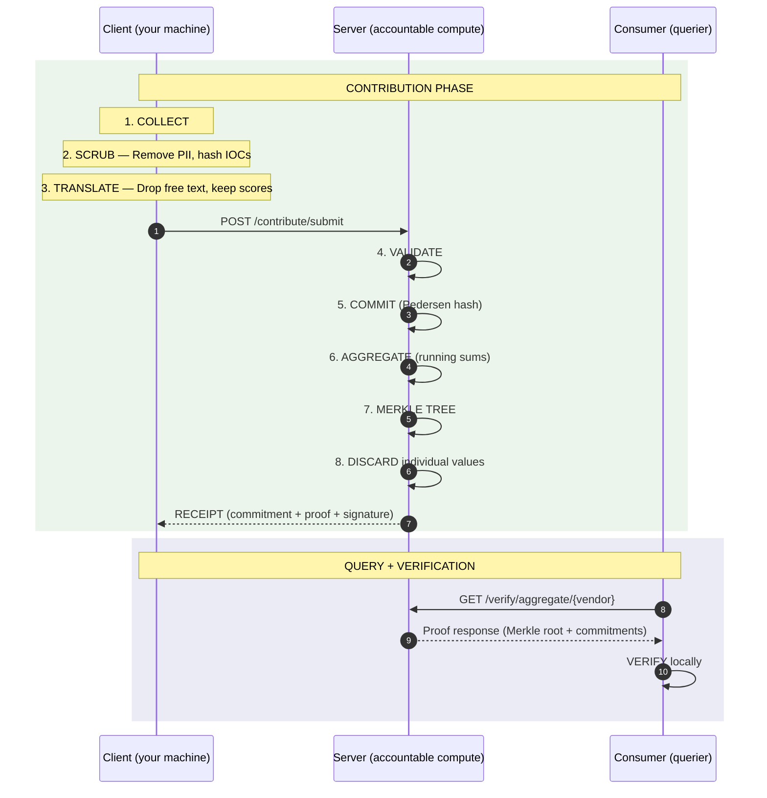

# Architecture -- Three-Party Protocol Flow

nur is a trustless aggregation protocol. Query data (threat models, IOCs, stacks) flows in. Response data (tool intel, remediation, pricing) flows back. Three parties participate: the **Client** (your machine), the **Server** (accountable compute), and the **Consumer** (querier). The protocol IS the product. Math, not promises.

---

## Sequence Diagram

---

## Contribution Phase (Steps 1-8)

### Client-side (Steps 1-3)

**COLLECT** -- Load raw security data from incident reports, vendor evaluations, or IOC feeds. The data stays on your machine in its original form.

**SCRUB** -- Remove personally identifiable information. IP addresses are hashed with HMAC-SHA256 (irreversible). Hostnames, employee names, and network topology are stripped entirely. The scrubbing logic runs locally and is open source.

**TRANSLATE** -- Drop free text, narrative descriptions, sigma rules, and remediation action strings. What remains: numeric scores, categorical labels, boolean flags, and MITRE ATT&CK technique IDs. This is what crosses the network boundary.

### Server-side (Steps 4-8)

**VALIDATE** -- Check schema conformance and range constraints. Reject malformed or out-of-bounds contributions.

**COMMIT** -- Create a Pedersen commitment over the contribution values. The commitment is information-theoretically hiding -- the server stores the commitment but cannot extract the original values.

**AGGREGATE** -- Update running sums, histogram bins, and frequency counters. The aggregate grows with each contribution.

**MERKLE TREE** -- Append the commitment to a tamper-evident, append-only Merkle tree. Every contribution is permanently bound. The server cannot alter, add, or remove contributions after the fact.

**DISCARD** -- Delete the individual contribution values. Only the commitment hash, the aggregate update, and the Merkle leaf remain. The original scores, individual data points, and per-org details are gone.

The server returns a **receipt**: the commitment hash, a Merkle inclusion proof, and a server signature. This receipt is your cryptographic evidence that the server accepted your contribution and cannot deny it.

---

## ADTC to ProofEngine Dice Chain

The client computes SHA-256 of the canonical JSON payload *before* submission. The server's ProofEngine independently computes `contribution_hash` from the same canonical form upon receipt. The receipt returns this server-computed hash.

If the hashes match, the entire transformation chain is verified end-to-end: extract, anonymize, differentially privatize, translate, commit. No data was altered in transit. No intermediate step introduced corruption.

This is the "dice chain" -- a chain of cryptographic attestations linking the Attested Data Transformation Chain (ADTC) on the client to the ProofEngine on the server. Each link in the chain is independently verifiable.

---

## Query and Verification Phase (Steps 9-10)

A consumer requests aggregate data for a specific vendor, technique, or category. The server constructs a proof from the Merkle root and the relevant commitments.

The consumer verifies the proof locally. If verification passes, the aggregate data is provably derived from real contributions -- not fabricated, not inflated, not selectively omitted.

Trust is mathematical, not institutional. The consumer does not need to trust the server. The cryptographic proof is self-verifying.

---

## Blind Category Discovery

When a contributor encounters a tool, vendor, or technique not in the existing taxonomy, they can propose it without revealing what it is.

1. The client computes `H = SHA-256(name:salt)` and sends only the hash to the server.
2. The server sees an opaque hash. It cannot determine what was proposed.
3. The server counts distinct organizations that propose the same hash.
4. When the count reaches the threshold (>= 3 distinct organizations), the server notifies proposers.
5. A proposer reveals the plaintext name and salt. The server verifies `SHA-256(name:salt) == H`.
6. The category is added to the public taxonomy.

This mechanism allows the taxonomy to grow organically from practitioner usage without any single contributor revealing what tools or techniques they use until enough peers independently validate the same category. No vendor marketing. No analyst opinions. Just convergent practitioner experience.

---

## What Gets Stored vs Discarded

| Stored (server retains) | Discarded (gone after commit) |
|------------------------|------------------------------|
| Commitment hashes (SHA-256) | Individual scores |
| Running sums per vendor | Per-org attribution |
| Technique frequency counters | Free-text notes |
| Merkle tree of all commitments | Sigma rules, action strings |
| Blind category hashes (opaque) | Raw IOC values |
| Revealed category names | Who proposed what (until reveal) |
| Eval dimension aggregates (price, support, performance, decision) | Raw dollar amounts, individual SLA times |
| BDP credibility scores (behavioral) | Per-org credibility profiles |
| Dice chain hashes (contribution_hash) | Pre-submission payload content |

---

## Network Effect

10 users = interesting. 100 = useful. 1,000 = indispensable.

The protocol enables trust. The users create value. At scale, switching cost is infinite -- you would lose the collective intelligence of every security team in your vertical. The data gets more valuable with every contribution, and no single organization can replicate the aggregate on its own.

This is why the protocol is open and the data license is permissive. The moat is the network, not the code.
