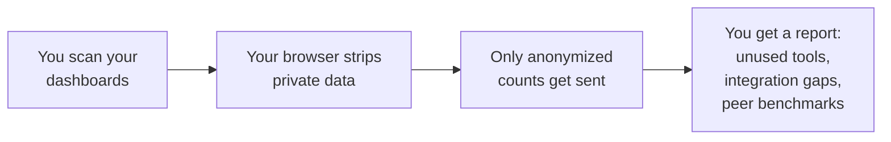
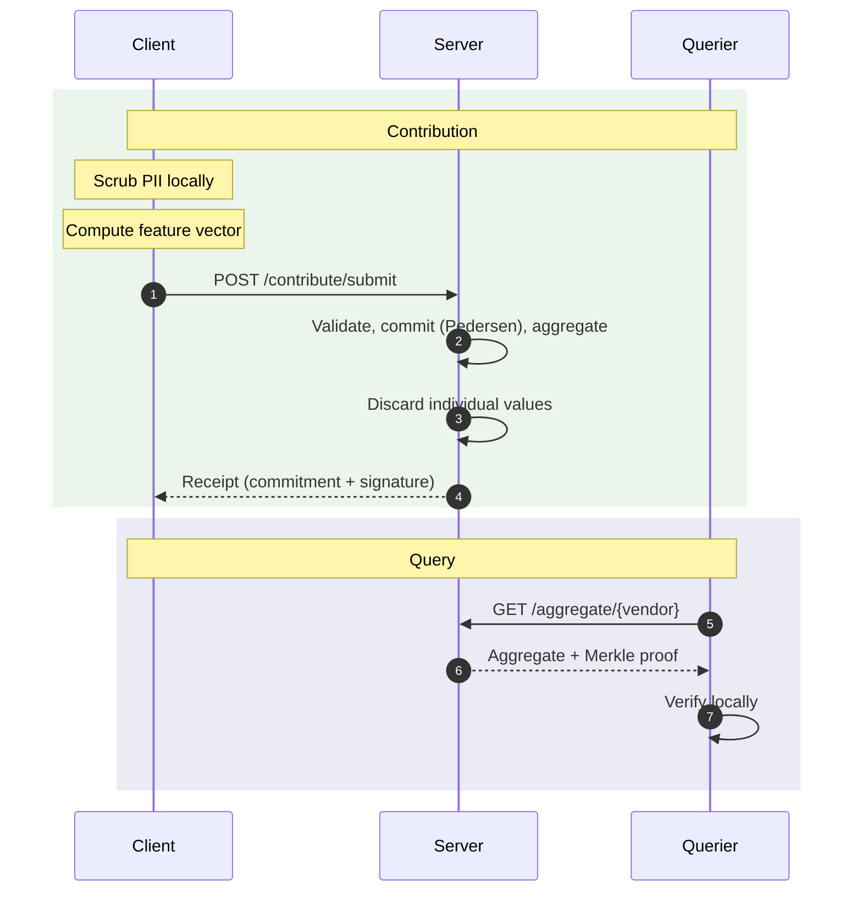

<div align="center">

# nur

**Before you buy another security tool, know what you have.**


[](LICENSE)
[](https://python.org)

</div>

---

## The problem

Every month another vendor pitches you. Another demo. Another "we need to talk about your security posture."

You don't have time for it. The industry is bloated. You already own a dozen tools you barely use. Before you buy anything new, you need to answer four questions:

1. **What does this tool actually do?** (not what the pitch deck says)
2. **Do I already have something that does this?**
3. **How do my current tools connect to each other?**
4. **What are my peers paying for the same thing?**

Nobody answers these today. Gartner costs six figures and vendors pay for their rankings. G2 reviews are gamed. DM-ing peers works, but it doesn't scale and nobody shares real numbers in public.

**nur answers these questions in 60 seconds, from the tools you already have open.**

---

## How it works

1. **Install the browser extension.** It's open source. It runs on your machine.
2. **Visit the dashboards you already log into.** AWS, CrowdStrike, Splunk, Okta, whatever.
3. **Click Scan.** You get a report showing what's unused, what's not integrated, and (once peers contribute) how your stack compares to similar companies.



Nothing leaves your browser without your approval. Emails, IP addresses, employee names, hostnames, and dollar amounts are stripped before anything is sent. You see exactly what will be transmitted before you click submit. Every line of code is open source.

---

## What you get back today

Install it, scan your stack. You immediately get:

- **Shelfware X-ray.** Every tool, every feature, colored by whether you actually use it. A real dollar figure on the features nobody touches.
- **Integration map.** Which of your tools talk to each other. Which should but don't.

Once 50 organizations have contributed, you also unlock:

- **Peer benchmarks.** What similar companies pay. What they use. What they dropped and why.

Until then, you still get value the moment you scan. You don't wait on anyone else.

---

## Who this is for

You own security at a growing company: a YC Series A-D, a zfellows portfolio company, or the first security hire at a mid-sized startup. You don't have six figures to spend on Gartner. Your peer group isn't giving you hard numbers.

**Install it. Scan one tool. Tell us what breaks.**

First 50 contributors unlock peer benchmarks for the whole community.

---

## Install

1. Clone this repo or download the `extension/` folder
2. Open `chrome://extensions` in Chrome
3. Enable **Developer Mode** (top right)
4. Click **Load unpacked** and select the `extension/` folder
5. Navigate to any dashboard you already use
6. Click the nur icon and hit **Full Scan**

After scanning, click **Utilization Report** to see your shelfware and integration gaps.

**Two modes:**
- **Capture Page** — scans only the page you're on
- **Full Scan** — crawls the entire dashboard, every tab, every section

---

## CLI (for people who want to automate)

```bash
pip install nur
nur init
nur eval --vendor crowdstrike        # submit a vendor review
nur market edr                       # see what peers actually use
```

Or contribute via web, no install needed: **[nur.saramena.us/contribute](https://nur.saramena.us/contribute)**

---

## For security engineers

If you want to vet this before installing, the things that matter:

### What leaves your browser

All anonymization runs client-side. Everything below is open source and auditable.

| Transmitted | Stripped before transmission |
|------------|------------------------------|
| Numeric scores (e.g. `9.2`) | Free-text notes |
| Detection rates, utilization percentages | IP addresses, hostnames |
| Boolean flags (`would_buy: true`) | Employee names, organization identity |
| Hashed threat indicators (SHA-256) | Network topology |
| Product feature identifiers | Raw dollar amounts (bucketed instead) |
| MITRE technique IDs (`T1566`) | Sigma rules, action strings |

After aggregation on the server, individual values are discarded. Only commitment hashes and running totals are retained. No per-organization attribution is possible.

### Cryptographic guarantees

- **Pedersen commitments** — the server cannot change your values after receipt
- **Merkle trees** — the server cannot add or remove contributions without detection
- **Zero-knowledge range proofs** — scores can be validated without revealing them
- **Client-side anonymization** — everything runs on your machine before transmission
- **Dice chains** — end-to-end hash attestation from source to aggregate

### Full protocol



### Regulatory compliance

- **HIPAA Safe Harbor** (45 CFR 164.514(b)) — all 18 identifiers removed and verified programmatically
- **GDPR Recital 26** — re-identification risk assessed across four vectors; individual values discarded
- **CISA 2015** — threat intelligence sharing carries explicit liability shield, antitrust exemption, and FOIA exemption
- **Attorney-client privilege preserved** — incident response firms contribute technique IDs and detection rates, never forensic report content

The code is open source. Compliance is verifiable, not a vendor assertion.

---

## Get in touch

Building in the open. Want to talk about what you're seeing in the field, or get access to the full platform?

<div align="center">

**[Message me on Signal](https://signal.me/#eu/priXbXasKbQOYugFXOJKfokwZCFrS94cKAOwBlV0tIZ8d563wcpIXIQYRpIdG3p_)**

[nur.saramena.us](https://nur.saramena.us)

</div>

---

## License

**Code:** [AGPL-3.0](LICENSE) &nbsp;|&nbsp; **Data:** [CDLA-Permissive-2.0](https://cdla.dev/permissive-2-0/)
