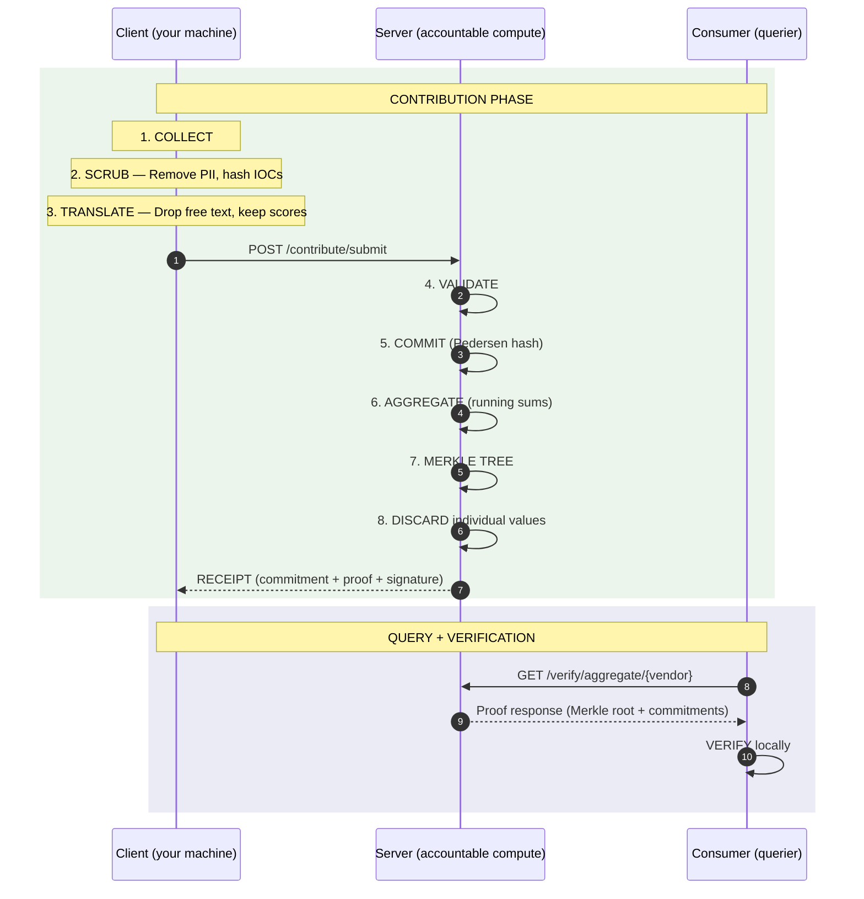

<div align="center">

# nur

**Peer-verified security intelligence -- what your peers actually use, what they pay, and what stopped the attack.**

[](LICENSE)
[](https://python.org)
[](#)

</div>

---

## The Problem

Vendor bakeoffs are duplicated across every org. Gartner costs six figures and is pay-to-play. G2 reviews are gamed. Signal DMs to peers are the real system -- unscalable and unstructured.

A CISO evaluated 12 vendors last quarter. All sounded the same.

An analyst with 4,000+ vendors in his database told us: "We're missing a very important part -- what works. We don't know."

---

## How It Works

**1. Contribute** -- Rate a vendor, submit attack data, or report IOCs. 60 seconds.

**2. Aggregate** -- Data committed, running sums updated, individual values discarded.

**3. Query** -- Get back what peers across your vertical actually use, pay, and what stopped attacks.

---

## What You Can Evaluate

| Dimension | What It Captures |
|-----------|-----------------|
| Detection | Overall score, detection rate, false positive rate |
| Price | Annual cost, per-seat pricing, contract length, discount percentage |
| Support | Quality score, escalation ease, SLA response hours |
| Performance | CPU overhead, memory usage, scan latency, deploy time |
| Decision | Chose this vendor?, main factor, would buy again? |

---

## Quick Start

```bash
pip install nur

nur init

nur register you@yourorg.com

# Submit a vendor evaluation
nur eval --vendor crowdstrike

# Query aggregate market intelligence
nur market edr

# Report IOCs
nur report lockbit_iocs.json
```

---

## Architecture

Three parties. No trust required.



See [ARCHITECTURE.md](ARCHITECTURE.md) for the full protocol walkthrough.

---

## Cryptographic Primitives

| Primitive | Purpose | Property |
|-----------|---------|----------|
| Pedersen Commitments | Hiding individual values in aggregates | Server can't alter values |
| Merkle Trees | Binding all contributions immutably | Can't add/remove undetected |
| ZKP Range Proofs | Validating scores without revealing them | Valid scores without revealing |
| Behavioral Differential Privacy | Defending against data poisoning | Behavior-based poisoning defense |
| Dice Chains | End-to-end verification of data transformation | End-to-end verification |
| Blind Category Discovery | Organic taxonomy creation | New categories without server learning names |

---

## What Gets Stored vs Discarded

| Stored (server retains) | Discarded (gone after commit) |
|------------------------|------------------------------|
| Commitment hashes | Individual scores |
| Running sums per vendor | Per-org attribution |
| Technique frequency counters | Free-text notes |
| Merkle tree of all commitments | Raw IOC values |
| Eval dimension aggregates | Raw dollar amounts |
| BDP credibility scores | Per-org credibility profiles |
| Dice chain hashes | Pre-submission payload content |

---

## Compliance

nur's anonymization pipeline clears **HIPAA Safe Harbor** (all 18 identifiers verified programmatically), **GDPR Recital 26** (re-identification assessed as not reasonably likely), and qualifies for **CISA 2015** safe harbor protections (liability shield, antitrust protection, FOIA exemption).

The code is open source. The compliance is verifiable by anyone.

See [COMPLIANCE.md](COMPLIANCE.md) for the full analysis.

---

## Data Collection

All anonymization runs **client-side** before any data leaves your organization. The server never sees raw data.

Current: CLI and web form submission.

Coming soon: browser extension and dashboard connectors for zero-friction data collection from tools you already use.

You see all the code.

---

## Pricing

| Tier | Price | Includes |
|------|-------|----------|
| Community | Free | Contribute + receive cryptographic receipts |
| Pro | $99/month | + Market maps, threat maps |
| Enterprise | $499/month | + API access, dashboard, RFP generation |

---

## Documentation

- [Architecture](ARCHITECTURE.md) -- Protocol flow, dice chains, data lifecycle
- [Protocol](PROTOCOL.md) -- Full protocol specification
- [Compliance](COMPLIANCE.md) -- HIPAA, GDPR, CISA 2015 analysis
- [Contributing](CONTRIBUTING.md) -- How to contribute data and code

---

## License

- **Code:** [AGPL-3.0](LICENSE)
- **Data:** [CDLA-Permissive-2.0](https://cdla.dev/permissive-2-0/)

---

<div align="center">

[nur.saramena.us](https://nur.saramena.us)

</div>
