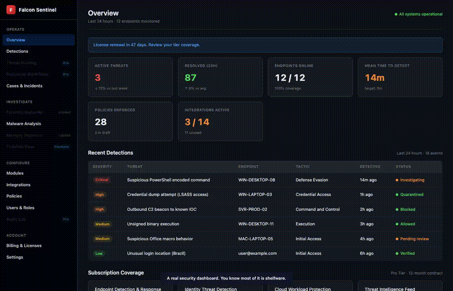
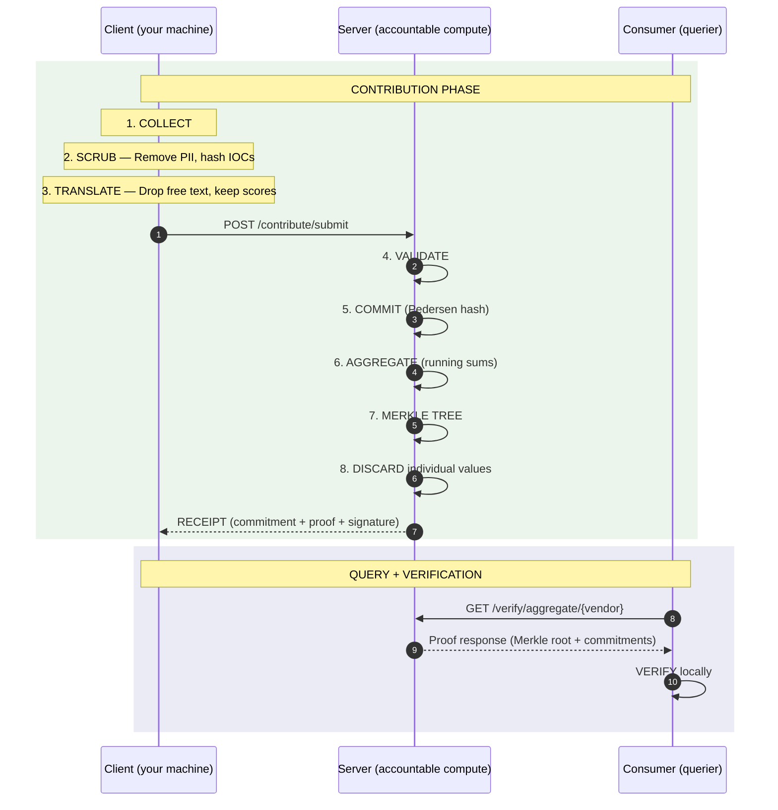

<div align="center">

# nur

**Peer-verified security intelligence -- what your peers actually use, what they pay, and what stopped the attack.**



[](LICENSE)
[](https://python.org)
[](#)

</div>

---

## The Problem

Vendor bakeoffs are duplicated across every org. Gartner costs six figures and is pay-to-play. G2 reviews are gamed. Signal DMs to peers are the real system -- unscalable and unstructured.

A CISO evaluated 12 AI security vendors for the Board last quarter. They all sounded the same. Different logos. Different positioning decks. Same pitch.

An analyst with 4,000+ vendors in his database told us: *"We're missing a very important part -- what works. We don't know."*

The data that matters -- what tool stopped the attack, what the real cost was, how long deployment took -- doesn't exist anywhere. nur fixes that.

---

## How It Works

**1. Contribute** -- Rate a vendor, submit attack data, or report IOCs. Via web form, CLI, or voice. 60 seconds.

**2. Aggregate** -- Your data is committed cryptographically, running sums are updated, and individual values are discarded. The server never sees who contributed what.

**3. Query** -- Get back what peers across your vertical actually use, what they pay, and what stopped real attacks. Cryptographic receipts prove your data was counted.



---

## What You Can Evaluate

| Dimension | What It Captures |
|-----------|-----------------|
| Detection | Overall score, detection rate, false positive rate |
| Price | Annual cost, per-seat pricing, contract length, discount |
| Support | Quality score, escalation ease, SLA response time |
| Performance | CPU overhead, memory usage, scan latency, deploy time |
| Decision | Chose this vendor?, main decision factor, would buy again? |

All fields committed, aggregated, individual values discarded.

---

## Quick Start

```bash
pip install nur
nur init
nur register you@yourorg.com
nur eval --vendor crowdstrike        # submit a vendor evaluation
nur market edr                       # see what peers actually use
nur report lockbit_iocs.json         # upload IOCs, get remediation intel
```

Or contribute via web -- no CLI needed: **[nur.saramena.us/contribute](https://nur.saramena.us/contribute)**

---

## Cryptographic Guarantees

| Primitive | What It Does |
|-----------|-------------|
| Pedersen Commitments | Server can't alter your values after receipt |
| Merkle Trees | Server can't add or remove contributions undetected |
| ZKP Range Proofs | Proves scores are valid without revealing them |
| Dice Chains | Client-side hash matches server commitment end-to-end |
| Blind Category Discovery | New threat categories emerge without server learning names until quorum |
| Behavioral Data Poisoning Defense | Trust scoring based on contribution patterns, not identity |

---

## What Leaves Your Organization

All anonymization runs **client-side** -- on your machine, before anything is transmitted. You can read every line of code.

| Transmitted | Stripped Before Transmission |
|------------|----------------------------|
| Numeric scores (e.g. `9.2`) | Free-text notes |
| Detection rates | IP addresses, hostnames |
| Boolean flags (`would_buy: true`) | Employee names, org identity |
| MITRE technique IDs (`T1566`) | Sigma rules, action strings |
| Hashed IOC values (SHA-256) | Network topology |
| Remediation categories | Raw dollar amounts |

**Server-side:** individual values are discarded after aggregation. Only commitment hashes and running sums are retained. No per-organization attribution is possible.

---

## Regulatory Compliance

nur's anonymization pipeline meets federal de-identification standards:

- **HIPAA Safe Harbor** (45 CFR 164.514(b)) -- all 18 identifiers mapped and verified programmatically
- **GDPR Recital 26** -- re-identification risk assessed across 4 vectors; individual values discarded, only aggregates retained
- **CISA 2015** -- threat intelligence sharing is explicitly protected with liability shield, antitrust exemption, and FOIA exemption
- **Attorney-client privilege** -- IR firms contribute technique IDs and detection rates, not forensic report content; privilege chain is never touched

The code is open source. The compliance is verifiable by anyone -- not a vendor assertion.

---

## Pricing

| Tier | Price | Includes |
|------|-------|----------|
| Community | Free | Contribute + cryptographic receipts |
| Pro | $99/month | + Market maps, vendor rankings, threat maps |
| Enterprise | $499/month | + API access, dashboard, RFP generation |

---

## License

**Code:** [AGPL-3.0](LICENSE) -- free for open source. Commercial use requires a [separate license](mailto:murtaza@saramena.us).

**Data:** [CDLA-Permissive-2.0](https://cdla.dev/permissive-2-0/)

---

<div align="center">

[nur.saramena.us](https://nur.saramena.us)

</div>
