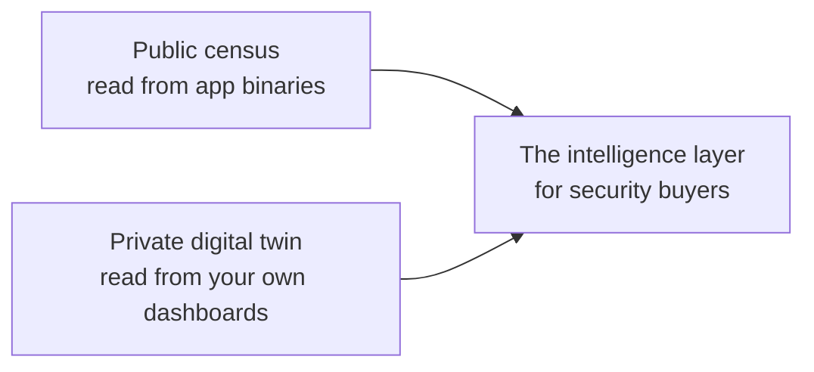

# nur

**A live census of the security tech the world actually runs.**

**[Explore the live census →](https://getnur.org/sdk)**

---

nur fingerprints the third-party **security and identity SDKs** embedded in public mobile-app binaries — no contributor, no telemetry, no cold start. We read which SDK is present straight from the shipped binary, the same way you'd read the ingredients off a label.

It's built on large-scale mobile binary analysis — the discipline of reading what's actually inside an app at scale — pointed at security posture rather than the adtech everyone else uses it for.

**320 apps analyzed. 27 security SDKs detected across 11 categories. 49% of the top apps embed a detectable security SDK.**

---

## Why this exists

Every security buyer asks the same question and can't answer it: *which vendors are actually deployed inside the apps I trust with my money and identity — and are they any good?*

The analysts don't know (Gartner runs surveys, not telemetry). The vendors won't say (their footprint is their competitive secret). And the firms that *can* detect embedded SDKs — 42matters, MightySignal, Sensor Tower — all sell it as adtech technographics for sales teams. **Nobody frames "which security SDK is in this app" as security posture intelligence.**

nur does. And because the census is built entirely from public data, it's valuable on day one — before a single organization contributes anything. That solves the cold-start problem that kills every "collective defense" platform (IronNet raised $400M and went bankrupt waiting for contributors).

---

## What the census shows

A neutral, dated map of which security/identity vendors lead each category across the top apps. A sample of what's in the live data at **[getnur.org/sdk](https://getnur.org/sdk)**:

| Category | Leaders (by app count, July 2026) |
|---|---|
| Identity / KYC | Persona, Mitek (traditional banking), Onfido (crypto / EU fintech) |
| Biometric auth | FaceTec — spreading from banking into dating apps |
| Fraud detection | Forter, Sardine AI — reaching beyond fintech into retail |
| Device integrity | Google Play Integrity, reCAPTCHA Enterprise |
| Certificate pinning | TrustKit |

The public tier reports **aggregate, vendor-named facts only** — presence, not verdicts. It is not a ranking, score, or recommendation. Vendor names are used nominatively. App-level detail (which specific apps run a given vendor) is available to registered users and vendor partners.

---

## Two data planes, one product

nur maps the security tech the world actually runs — first from the outside, then from the inside.

```mermaid
flowchart LR
    A[Public census<br/>read from app binaries] --> C[The intelligence layer<br/>for security buyers]
    B[Private digital twin<br/>read from your own dashboards] --> C
```

- **The public census** (this repo's method) proves the technique on public data. Valuable at contributor-count zero.
- **The private digital twin** brings the same lens inside your org: it reads your deployed security tools from the dashboards you already log into, anonymizes everything client-side, benchmarks against peers, and simulates named threats against your real stack. Try it → **[getnur.org/simulate](https://getnur.org/simulate)**

Public data proves the method. Your own data makes it yours.

---

## The method (open source)

This repo demonstrates *how* the census reads SDKs from public binaries — the taxonomy and the reference approach, not the production fingerprint library.

- **iOS:** third-party frameworks ship as named `.framework` directories inside the app bundle. The framework name is present in the unencrypted archive metadata — no decryption, no DRM circumvention. `Persona2.framework`, `Onfido.framework`, `TrustKit.framework` announce themselves.
- **Android:** SDKs ship as Java/Kotlin classes inside the DEX. Package prefixes (`com.withpersona`, `io.sentry`, `com.datadog`) identify the vendor.

The 11-category security taxonomy (identity/KYC, app shielding/RASP, biometric auth, mobile threat defense, fraud detection, device integrity, bot protection, cert pinning, auth, payment security, MDM) is the schema everything hangs off.

> **Legal basis.** Analyzing a binary you legitimately obtained to extract a functional fact is fair use (*Sega v. Accolade*, *Sony v. Connectix*). "Which SDK is present" is an unprotected fact (*Feist*). No DRM is circumvented — iOS framework names live in the unencrypted archive.

---

## The private twin: client-side by construction

The org-facing side of nur never sees your raw data. Everything sensitive is anonymized on your machine before anything is transmitted. This is auditable, open-source code.

| Transmitted | Stripped before transmission |
|------------|------------------------------|
| Numeric scores, utilization percentages | Free-text notes |
| Boolean flags (`feature_enabled: true`) | IP addresses, hostnames |
| Hashed indicators (SHA-256) | Employee names, organization identity |
| Product / feature identifiers | Network topology |
| MITRE technique IDs (`T1566`) | Raw dollar amounts (bucketed instead) |

### Cryptographic guarantees

- **Pedersen commitments** — the server cannot alter your values after receipt
- **Merkle trees** — the server cannot add or drop contributions undetected
- **Zero-knowledge range proofs** — values validated without being revealed
- **Client-side anonymization** — everything runs on your machine first
- **Dice chains** — end-to-end hash attestation from source to aggregate

### Regulatory posture

- **HIPAA Safe Harbor** (45 CFR 164.514(b)) — all 18 identifiers removed and verified programmatically
- **GDPR Recital 26** — re-identification risk assessed; individual values discarded
- **CISA 2015** — threat-intelligence sharing carries an explicit liability shield
- **Attorney-client privilege preserved** — IR firms contribute technique IDs and detection rates, never forensic report content

The two planes are architecturally walled: the public census contains **no contributed data at all**, and the private twin discards individual values after aggregation. Compliance is verifiable in code, not a vendor assertion.

---

## Who's building this

nur is built by Murtaza Munaim — 15 years in offensive security: staff hardware security engineer at Google breaking secure boot and firmware, Square's security team, and Visa's mobile red team. Large-scale mobile binary analysis has been the through-line the whole way.

---

## Get in touch

Building in the open. Want to talk about what you're seeing in the field, or get access to the full platform?

**[hello@getnur.org](mailto:hello@getnur.org)** &nbsp;·&nbsp; **[getnur.org](https://getnur.org)**

---

## License

**Code:** [AGPL-3.0](LICENSE) &nbsp;|&nbsp; **Data:** [CDLA-Permissive-2.0](https://cdla.dev/permissive-2-0/)
